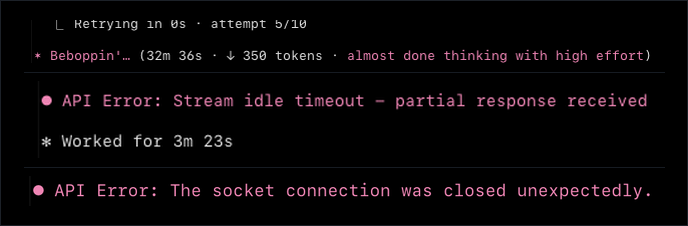

<p align="center">
  <picture>
    <source media="(prefers-color-scheme: light)" srcset="docs/readme/hero-light.svg">
    
  </picture>
</p>

<p align="center">
  <a href="https://github.com/jas0xf/claude-unstuck/releases"></a>
  &nbsp;
  <a href="#why-its-ipv6--the-evidence"></a>
</p>

> **Claude Code freezing mid-task?** On affected home networks the freeze rides the **IPv6 path to Anthropic** — not Claude itself. `claude-unstuck` pins Claude to IPv4, where it almost never hangs. The [evidence](#why-its-ipv6--the-evidence) is at the bottom.

---

## Quick start

**Install** — macOS / Linux:

```sh
curl -fsSL https://raw.githubusercontent.com/jas0xf/claude-unstuck/main/install.sh | sh
```

Windows (PowerShell):

```powershell
irm https://raw.githubusercontent.com/jas0xf/claude-unstuck/main/install.ps1 | iex
```

<sub>Single binary in `~/.local/bin`, no admin, no background service — <a href="https://raw.githubusercontent.com/jas0xf/claude-unstuck/main/install.sh">view install.sh</a> first if you like. Restart your terminal after; if `claude-unstuck` isn't found, add that folder to your `PATH`.</sub>

**Fix it** — once, for every app:

```sh
sudo claude-unstuck on
```

On **Windows**, run `claude-unstuck on` in an Administrator PowerShell (no `sudo`). Afterward plain `claude` just works — no prefix to remember.

> **Only Claude's traffic to Anthropic moves to IPv4.** IPv6 stays on, DNS is untouched, no daemon runs, and every other app is unaffected. Reverse anytime with `sudo claude-unstuck off`.

<sub>No admin rights? Run `claude-unstuck` in place of `claude` to fix just that one session. Reboot persistence (`--persist`) and other flags are in the [command reference](#commands--options) below.</sub>

## Check your own path (optional)

Not sure the freeze is the IPv6 thing? `claude-unstuck doctor` runs a couple of **real Claude turns** over each path and prints *your* numbers — it changes nothing and costs a few tokens. (A plain ping can't reproduce the freeze; it happens *mid-stream*, so `doctor` drives real turns to catch it.)

<details>
<summary>What <code>doctor</code> shows</summary>

```
  claude-unstuck — checking if Claude Code hangs on your connection

  ✔ IPv4 — Claude responded every time (median 3.8s)
  ✘ IPv6 — Claude HUNG (100% of turns froze)

  ➜ DIAGNOSIS  Claude hangs over IPv6 but runs fine over IPv4. Fixable.
```

Every fixed session also ends with a receipt confirming all upstream connections used IPv4:

```
[claude-unstuck] running over IPv4: claude
[claude-unstuck] ✅ done — all 10 upstream connections used IPv4
```
</details>

## Why it's IPv6 — the evidence

You've restarted Claude. Restarted your terminal. Blamed your Wi-Fi, your VPN, your account. These are three **real sessions**, captured live:

<p align="center">
  
</p>

And it's not just you — it's one of the most-reported bugs on the tracker:

<p align="center">
  <a href="https://github.com/anthropics/claude-code/issues/26224"></a>
  <a href="https://github.com/anthropics/claude-code/issues/13224"></a>
  <a href="https://github.com/anthropics/claude-code/issues/31932"></a>
  <a href="https://github.com/anthropics/claude-code/issues/8658"></a>
  <a href="https://github.com/anthropics/claude-code/issues/32867"></a>
</p>

We packet-captured these freezes for weeks — decrypted TLS, byte-level, across machines, ISPs and VPNs. The answer was embarrassingly specific: on the affected Spectrum line, **IPv6 hung ~74% of sessions while IPv4 hung ~5%** — same machine, same line, only the address family differs (aggregated across sessions; the hang is time-varying). Counting only the large (>100 KB) requests real coding sessions send, IPv6 went **no-response 54% of the time vs 0% over IPv4**.

<p align="center">
  <picture>
    <source media="(prefers-color-scheme: light)" srcset="docs/readme/hangrate-light.svg">
    
  </picture>
</p>

**On the wire**, the request uploads in full and the server **ACKs every byte** — then nothing comes back. In the cleanest case it's pure silence: `HTTP 200` and `message_start`, then **0 bytes** until the client gives up around 180s later. (Sometimes the server sends a TCP **RST** or **FIN** instead — but always *after* the upload is fully received.) The network delivered everything; the answer never does. That's why nothing on your side ever fixed it.

<p align="center">
  <picture>
    <source media="(prefers-color-scheme: light)" srcset="docs/readme/wire-light.svg">
    
  </picture>
</p>

And **every other suspect fell**. This began as a CSE 291Y course project — two weeks of decrypted-TLS captures (`mitmproxy` + `tcpdump`, per-event SSE timing). One by one, the app, the client, the region, the VPN, the machine and IP reputation were ruled out; the freeze follows the **network, not your computer** (clean on an AT&T hotspot, broken on Spectrum). The fault domain narrows to the **IPv6 path between the ISP and Cloudflare**.

<p align="center">
  <picture>
    <source media="(prefers-color-scheme: light)" srcset="docs/readme/investigation-light.svg">
    
  </picture>
</p>

> 📊 **Full deck** — 10-region global probe, two-ISP controls, VPN confound analysis, byte-level captures:
> **[▸ Measuring Claude — open the slides](https://htmlpreview.github.io/?https://github.com/jas0xf/claude-unstuck/blob/main/docs/slides/measuring-claude.html)**
> · [source](docs/slides/measuring-claude.html)

<details>
<summary><b>And it provably works — packet-level</b></summary>

- **Linux:** with `sudo claude-unstuck on` active, a real `claude -p` session produced **0 IPv6 packets and 867 IPv4 packets** to the Anthropic API; `off` left the routing table clean.
- **macOS:** all 8 tunneled connections of a real session — including the ~1.1 MB context upload — went to IPv4.
- **Windows:** the scoped firewall block/undo is unit-tested across the CI matrix, and the live `netsh` round-trip was validated on real Windows 11.
</details>

## Commands & options

<details>
<summary><b>Full command reference</b></summary>

**Safe · no root — start here**

| command | what it does |
|---|---|
| `claude-unstuck doctor` | check whether you have the bug (a few tokens, changes nothing) |
| `claude-unstuck` | run Claude over IPv4 for this terminal only (nothing installed) |

**System-wide · needs admin**

| command | what it does |
|---|---|
| `sudo claude-unstuck on` | fix every app at once. **Windows:** `claude-unstuck on` in an Administrator PowerShell (no `sudo`) |
| `sudo claude-unstuck off` | remove the system-wide fix |
| `claude-unstuck status` | show what's installed; warns if Anthropic's IPs rotated since |

> **On Windows:** drop `sudo` and run in an Administrator PowerShell. The no-admin commands (`claude-unstuck`, `doctor`) are identical on every platform.

`on` resolves Anthropic's **current** addresses at apply time (nothing hardcoded). Extras: `--persist` (survive reboots — macOS/Linux clear routes on reboot; Windows persists on its own) · `--for 24h` (self-expiring).
</details>

<details>
<summary><b>Why not just edit /etc/hosts or set NODE_OPTIONS?</b></summary>

We tried. Claude Code is a Bun-compiled binary: packet captures show it **silently bypasses `/etc/hosts`** and ignores Node's `--dns-result-order`. The two mechanisms that demonstrably work are `HTTPS_PROXY` (what the per-session command uses) and the OS routing/firewall layer (what `on` uses).
</details>

<details>
<summary><b>FAQ</b></summary>

**Is this Anthropic's fault? My ISP's? Cloudflare's?**
Honestly: unknown. The failure is server-side silence on specific network paths; captures can't see past the TLS endpoint. What's *provable* is the correlation (same machine, account, hour: IPv6 hangs, IPv4 doesn't) and that forcing IPv4 fixes it. Run `doctor` to measure *your* path instead of trusting ours.

**Will IPv4 be slower?**
Same anycast front door for both families. In our measurements IPv4 was equal or faster on affected networks — and it can hardly be slower than a 32-minute stall.

**Doctor says "healthy" but Claude still hangs.**
Hangs can be intermittent — re-run `doctor` *while* it's hanging. If IPv6 is clean even then, your issue is something else (account concurrency and rate limits produce similar symptoms).

**Affiliated with Anthropic?**
No. Independent tool from a university course research project. MIT.
</details>
