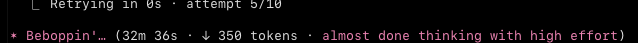
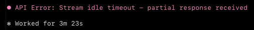
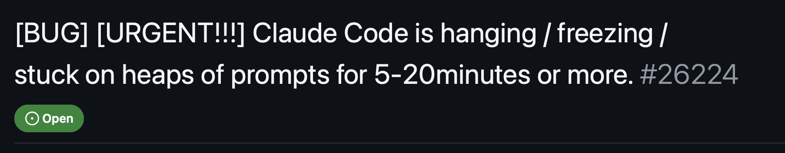
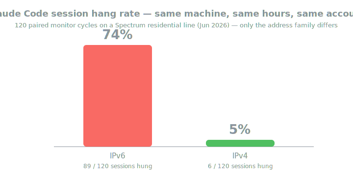
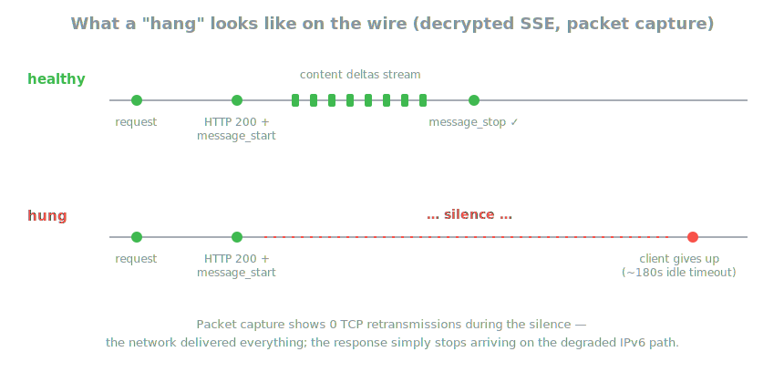

<div align="center">

# claude-unstuck

### Claude Code frozen again? It's probably not Claude. It's your network's IPv6 path — and you can prove it in 30 seconds.

[](https://github.com/jas0xf/claude-unstuck/actions/workflows/ci.yml)
[](https://github.com/jas0xf/claude-unstuck/releases)


</div>

---

## Sound familiar?

<p align="center"></p>
<p align="center"><sub><b>32 minutes. 350 tokens. Attempt 5 of 10.</b> A real session, captured live.</sub></p>

<p align="center"></p>

<p align="center"></p>

You've restarted Claude. Restarted your terminal. Blamed your Wi-Fi, your VPN, your account.
So has everyone else:

<p align="center"></p>

We packet-captured these freezes for weeks — decrypted TLS, byte-level, across
machines, ISPs, and VPNs. On the affected home networks the answer was
embarrassingly specific: **sessions over IPv6 froze constantly; the exact same
machine, account and hour over IPv4 almost never did.**

<p align="center"></p>

## The 30-second version

Install it:

```sh
curl -fsSL https://raw.githubusercontent.com/jas0xf/claude-unstuck/main/install.sh | sh
```

**Check** whether you have the bug (changes nothing, costs a few tokens):

```sh
claude-unstuck doctor
```
```
  claude-unstuck — checking if Claude Code hangs on your connection

  ✔ IPv4 — Claude responded every time (median 3.8s)
  ✘ IPv6 — Claude HUNG (100% of turns froze)

  ➜ DIAGNOSIS  Confirmed: Claude hangs over IPv6 but runs fine over IPv4.
               This is the bug — and it's fixable.

  Fix it now (no admin, just use Claude normally):
      claude-unstuck
```

**Fix** it — just run Claude through `claude-unstuck` instead of `claude`:

```sh
claude-unstuck          # = claude, but pinned to IPv4 for this session
```

`doctor` runs a couple of **real Claude turns** over each path (a plain ping
can't reproduce the freeze — it happens mid-stream), so it catches the actual
hang instead of guessing.

<p align="center"></p>

Every session ends with a receipt, so you never have to trust us:

```
[claude-unstuck] running over IPv4: claude
[claude-unstuck] ✅ done — all 10 upstream connections used IPv4
```

> Want a zero-token connectivity sanity check (no Claude turns)?
> `claude-unstuck probe` runs unauthenticated HTTPS probes and prints an
> anonymized, paste-ready snippet for the GitHub issue threads.

## What's actually happening on the wire

This is what every captured freeze looks like, decrypted:

<p align="center"></p>

The request arrives. The server says `HTTP 200`, sends `message_start`…
then **silence**. No error. No data. And crucially — **zero TCP
retransmissions** during the silence. The network delivered every byte both
ways; the response simply stops coming on the degraded IPv6 path. That's why
nothing on your side ever fixed it: there was nothing on your side to fix.

Why IPv6? Your home IPv6 address is individually routable (no NAT), and
residential IPv6 can take different — sometimes degraded — ingress paths than
IPv4 into the API's edge. Whatever the upstream root cause, the observation
is boringly reproducible: **force IPv4, hangs stop.**

Full methodology — captures, controls across two ISPs, VPN confound analysis —
in the [research slides](docs/slides/).

## The whole command set

| command | what it does | scope | root? |
|---|---|---|---|
| `claude-unstuck` | run Claude over IPv4 (just use Claude) | this session | no |
| `claude-unstuck doctor` | check if you have the bug (a few tokens) | — | no |
| `sudo claude-unstuck on` | install the fix for every app | system-wide | yes |
| `sudo claude-unstuck off` | remove the system-wide fix | system-wide | yes |
| `claude-unstuck status` | show what's installed | — | no |

`on` resolves the **current** AAAA records at apply time (nothing hardcoded),
records exactly what it installed, and is fully reversible. Extras:

```sh
sudo claude-unstuck on --persist    # also survive reboots
sudo claude-unstuck on --for 24h    # self-expiring
claude-unstuck status               # warns if Anthropic's IPs rotated since
```

<details>
<summary><b>Why not just edit /etc/hosts or set NODE_OPTIONS?</b></summary>

We tried. Claude Code is a Bun-compiled binary: packet captures show it
**silently bypasses `/etc/hosts`** and ignores Node's `--dns-result-order`.
The two mechanisms that demonstrably work are `HTTPS_PROXY` (what the session
command uses) and the OS routing/policy layer (what `on` uses).
</details>

<details>
<summary><b>Why not disable IPv6 entirely?</b></summary>

Heavy-handed and breaks other things. This touches only the Anthropic API
addresses (Windows: only address-selection preference), and `off` restores
everything.
</details>

## Verified, not vibes

- **macOS — real session:** all 8 tunneled connections, including the
  ~1.1 MB context upload, went to IPv4. Session completed normally.
- **Linux — real session + packet capture:** with `sudo claude-unstuck on`
  active, a plain `claude -p` session produced **0 IPv6 packets and 867 IPv4
  packets** to the Anthropic API. `off` left the routing table clean.
- **Windows:** the prefix-policy fix/undo round-trip runs in
  [CI on a real Windows runner](.github/workflows/ci.yml) on every commit.
  A live Claude-session report from a Windows machine would be welcome.

<details>
<summary><b>FAQ</b></summary>

**Is this Anthropic's fault? My ISP's? Cloudflare's?**
Honestly: unknown. The failure is server-side silence on specific network
paths; captures can't see past the TLS endpoint. What's provable is the
correlation (same machine, account, hour: IPv6 hangs, IPv4 doesn't) and the
fix. `doctor` exists so you can measure *your* path instead of trusting ours.

**Will IPv4 be slower?**
Same anycast front door for both families. In our measurements IPv4 was
equal or faster on affected networks — and it can hardly be slower than a
32-minute stall.

**Doctor says "healthy" but Claude still hangs.**
Hangs can be intermittent — re-run `doctor` *while* it's hanging. If IPv6 is
clean even then, your issue is something else (account concurrency and rate
limits produce similar symptoms).

**Affiliated with Anthropic?**
No. Independent tool from a university course research project. MIT.
</details>

## Install from source

```sh
go install github.com/jas0xf/claude-unstuck/cmd/claude-unstuck@latest   # Go 1.24+, zero deps
```

## If this saved your afternoon

⭐ the repo, and paste your `doctor` snippet into the issue threads — every
measured path makes the picture clearer for everyone (and for Anthropic).

<sub>MIT · not affiliated with Anthropic · raw captures are never published — they contain prompts and tokens</sub>
